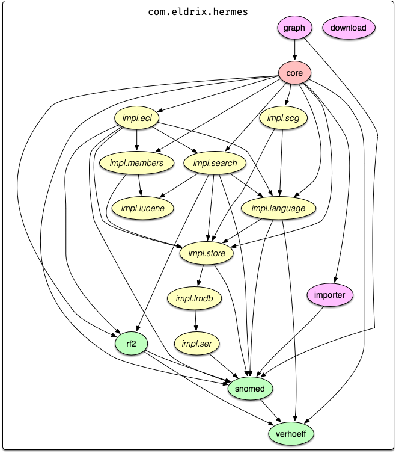

# Development


`Hermes` consists of two distinct subprojects:

1. A command-line tool
2. A library

The command-line tool provides a mechanism to download, import and index SNOMED CT, as well as run a terminology server. Source code can be found in [/cmd](/cmd).

The library is used by the command-line tool, but can be used by other applications to embed SNOMED CT into other applications. Source code can be found in [/src](/src). 

Hermes generates a file-based 'database' consisting of three sub-databases:

* core component store : keys and values, and indexes  (LMDB)
* description index : a search index for descriptions (Apache Lucene)
* members index : a search index for refset members (Apache Lucene)

LMDB is a very fast memory-mapped key value store.
See [https://www.symas.com/lmdb](https://www.symas.com/lmdb).

Apache Lucene provides very fast indexing and search. See [https://lucene.apache.org](https://lucene.apache.org).

`Hermes` is essentially a very thin wrapper around these two highly-optimised and well engineered backends.

### Namespace organisation

The library provides a single unified API `com.eldrix.hermes.core`. This can be used from Java or Clojure clients directly. 

The other top-level namespaces comprise:

* `com.eldrix.hermes.graph`: Graph-API using multiple discrete resolvers via [Pathom](https://pathom3.wsscode.com).
* `com.eldrix.hermes.download`: API to download SNOMED distributions
* `com.eldrix.hermes.importer`: API to examine and consume SNOMED distributions
* `com.eldrix.hermes.rf2`: Specifications for SNOMED RF2 to enable validation and runtime synthetic distribution generation
* `com.eldrix.hermes.snomed`: Core SNOMED model data types and well known identifiers
* `com.eldrix.hermes.verhoeff`: Implementation of the Verhoeff check digit algorithm



Namespaces in `com.eldrix.hermes.impl` should be regarded as private and subject to change.  

* `com.eldrix.hermes.impl.ser` : Low-level serialization of SNOMED data types
* `com.eldrix.hermes.impl.lmdb` : Low-level LMDB implementation
* `com.eldrix.hermes.impl.store` : An abstract 'store' for SNOMED data
* `com.eldrix.hermes.impl.lucene` : Low-level Lucene utility functions
* `com.eldrix.hermes.impl.search` : Search index for descriptions
* `com.eldrix.hermes.impl.members` : Search index for refset members
* `com.eldrix.hermes.impl.language` : Language and Locale matching
* `com.eldrix.hermes.impl.ecl` : Implementation of the SNOMED expression constraint language
* `com.eldrix.hermes.impl.scg` : A partial implementation of compositional grammar

The LMDB implementation was deliberately not designed to be a generic key value store, but instead optimised for the domain, and therefore speed of access. That decision could be changed in the future. 

## How to build from source code

### Compile Java source files

```shell
clj -T:build compile-java
```

#### Run compilation checks (optional)

```
clj -M:check
```

#### Run unit tests and linters (optional)

By default, testing includes tests against a real local SNOMED CT datafile
named 'snomed.db' in the local directory. This is ideal for development.

However, for automation purposes, you can exclude those tests and rely on
tests using synthetic data instead.

```
clj -M:test                # Run all tests
clj -M:test -e :live       # Run tests but exclude those needing a real local SNOMED distribution
```

Additional test coverage reports and linting are also available:

```
clj -M:test/cloverage
clj -M:lint/kondo
clj -M:lint/eastwood
```

#### View outdated dependencies

```
clj -M:outdated
```

You can view a complete list of dependencies; try:

```
clj -X:deps tree
```

#### Building uberjar

Build the uberjar:

```shell
clojure -T:build uber
```

To release the uberjar to GitHub, if you have the right credentials:

```shell
clojure -T:build release
```

#### Building library jar

A library jar contains only `hermes`-code, and none of the bundled dependencies.

```shell
clojure -T:build jar
```

Or you can install `hermes` into your local maven repository:

```shell
clojure -T:build install
```

To deploy the library jar to clojars, if you have the right credentials

```shell
clojure -T:build deploy
```


